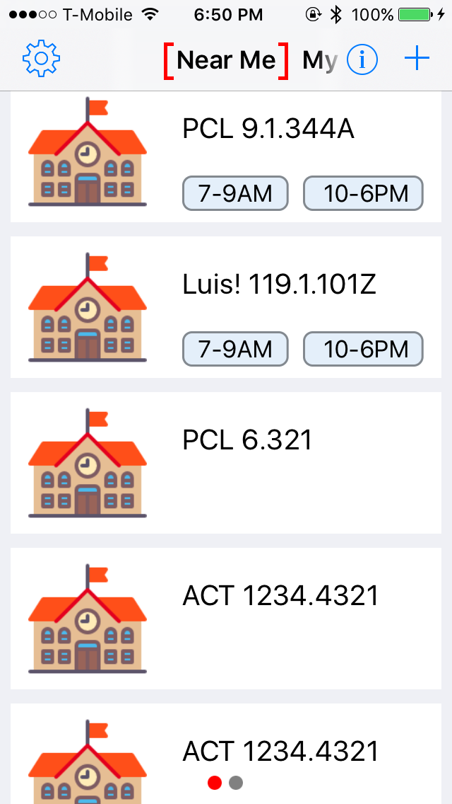
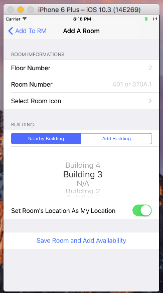
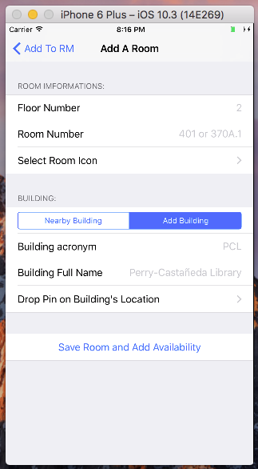
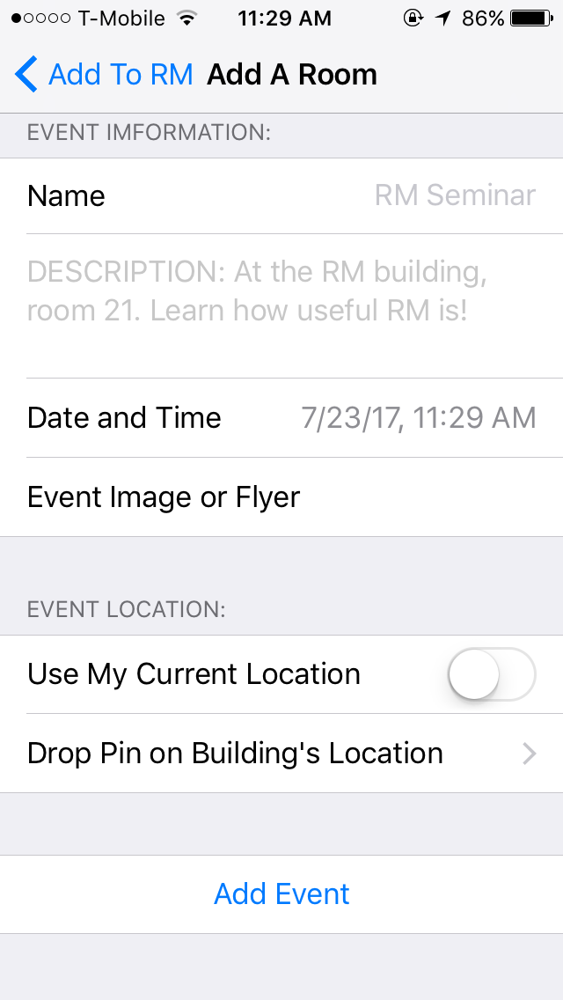
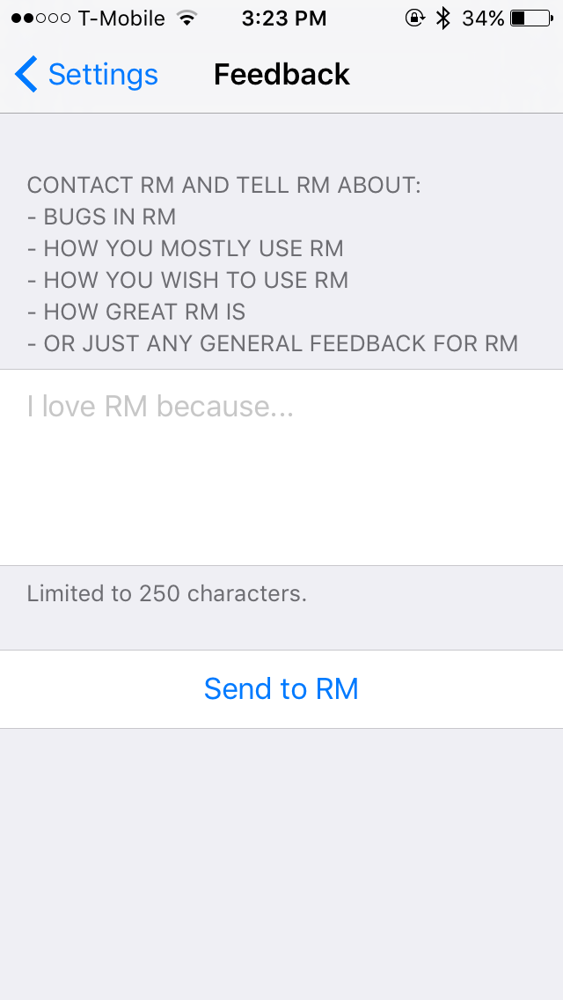
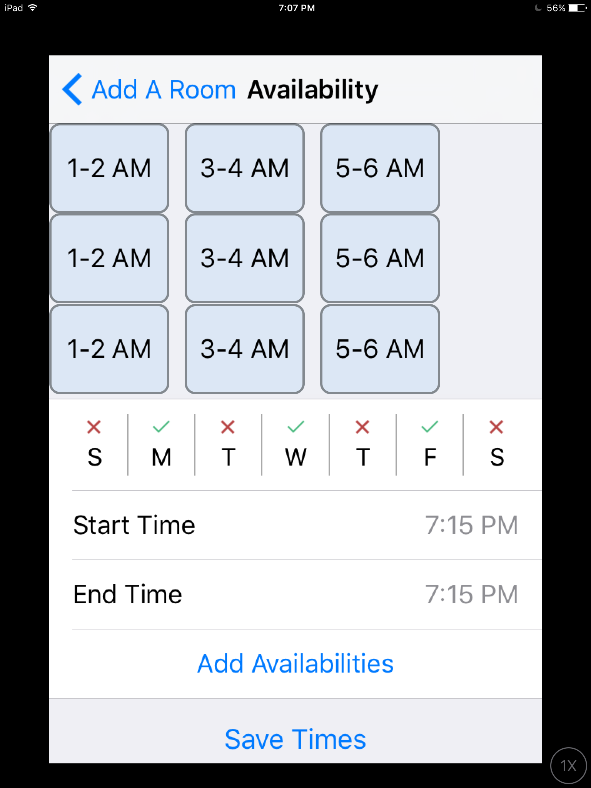
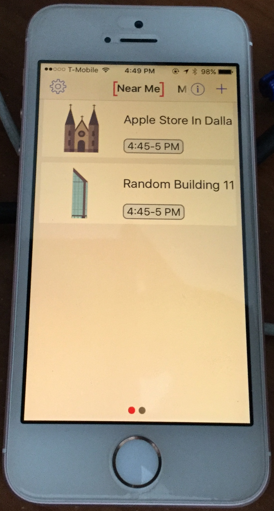
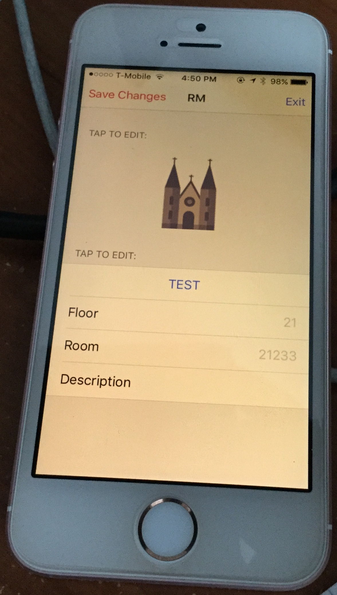

# RM
RM (short for "Room"), is a project I started working on mid-2016, after my Sophmore year in college. I stopped working on this project late 2017.

All of the source code is under the [RM](https://github.com/LF-luis/RM/tree/master/RM) directory.

The application was built alongside a Microsoft Azure backend application which will not be open-sourced.

## Build
- Xcode 8.3.3
- Swift 3
- Cocoapods and dependencies copies are included in repo

## Purpose of RM
RM started initially as an app to help college students find places where they could study or quietly relax in a large campus.  
After a while, the idea expanded to be able to find any kind of event going on around you at the moment. This is where the app currently stands.

## Purpose of this repo
I've written a lot of code in my free in the past few years, instead of letting it sit on my computer I have chosen to release it freely.  

I also hope that someone may be able to find this useful and contribute or fork this repo for their own project. Notably you'll find use of MicrosoftAzureMobile.framework to manage User log in/out session, as well as to call various secured web APIs. Also actionable Google Maps embedded in sub-views.

## Screenshots
<table>
  
Some notable views of the app:   (note that this is all test data populating the views)

  <tr>
    <th> Home View   (Shows times of events) </th>
    <th> Add Room</th>
    <th> Add Room and Building</th>
  </tr>
  <tr>
    <th>
      
    </th>
    <th>
      
    </th>
    <th>
      
    </th>
  </tr>
  <tr>
    <th>Add Event</th>
    <th>Feedback View</th>
    <th>Add Availability   (first iteration) </th>
  </tr>
  <tr>
    <th>
      
    </th>
    <th>
      
    </th>
    <th>
      
    </th>
  </tr>
</table>

 

<table>
  
Some images of the first iteration running on hardware:

  <tr>
    <th> 
Home View
 </th>
    <th> 
Add Room View
 </th>
  </tr>
  <tr>
    <th>
      
    </th>
    <th>
      
    </th>
  </tr>
</table>

 
 
 
Note: This is a project I stopped working on about 3 years ago, thus it does not reflect my current level of experience as an iOS developer.  